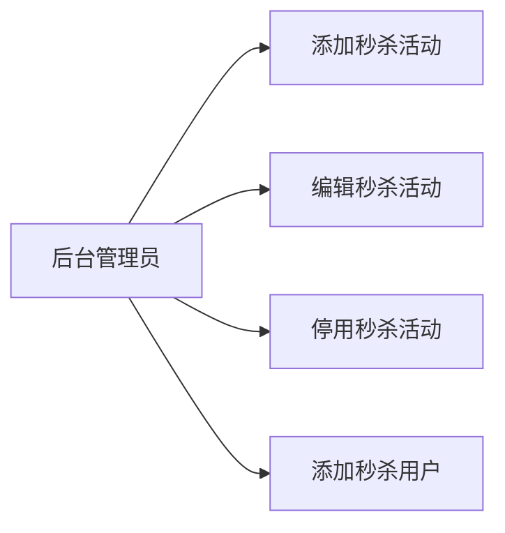
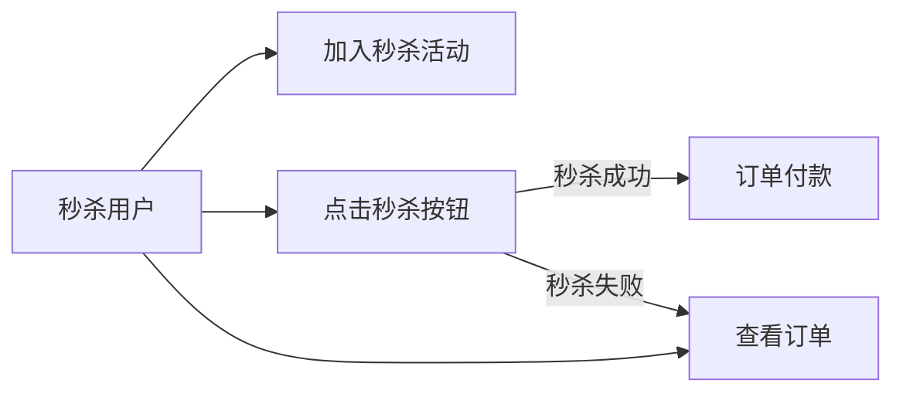
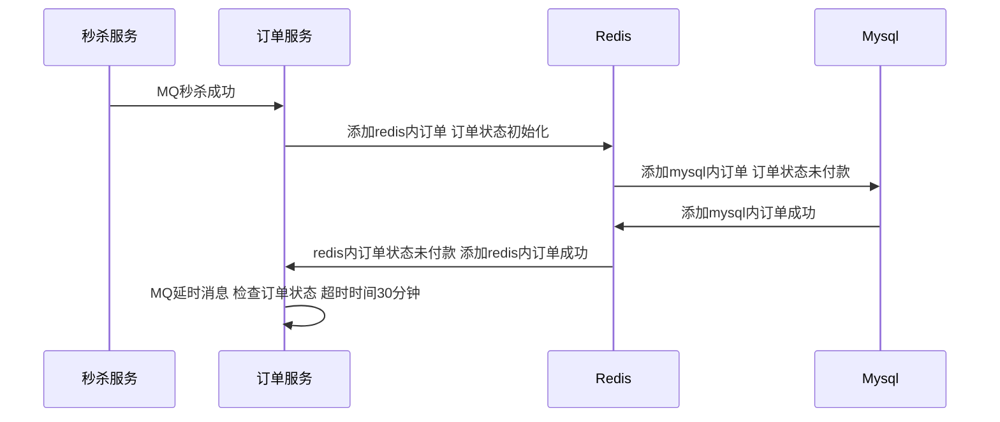
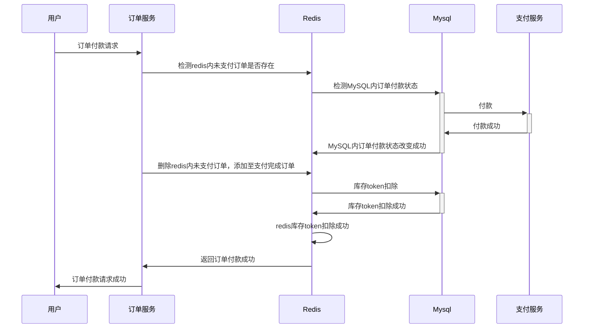
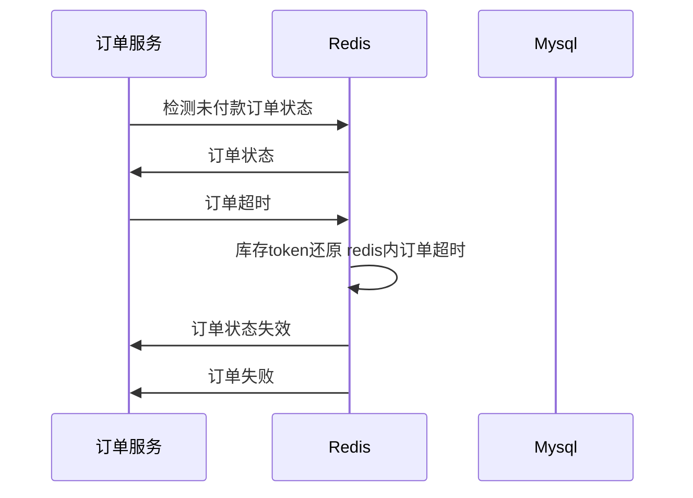
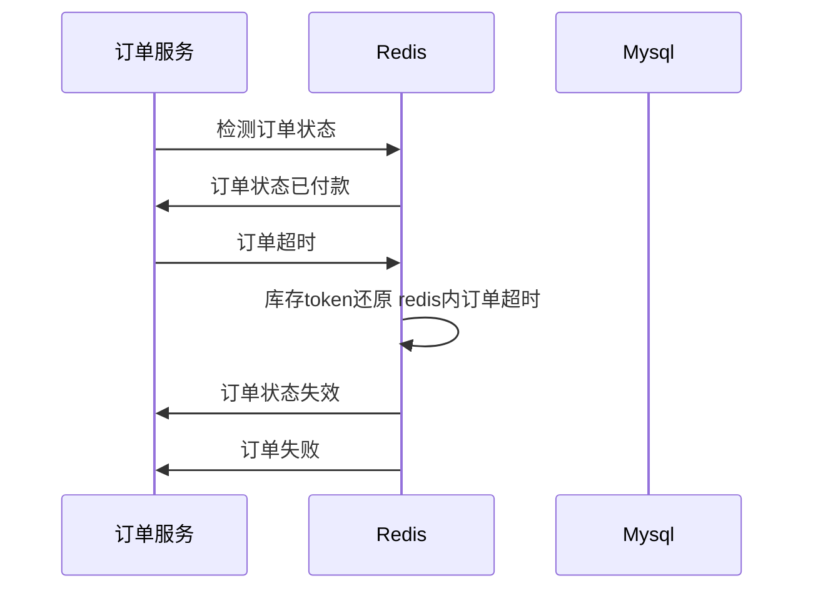
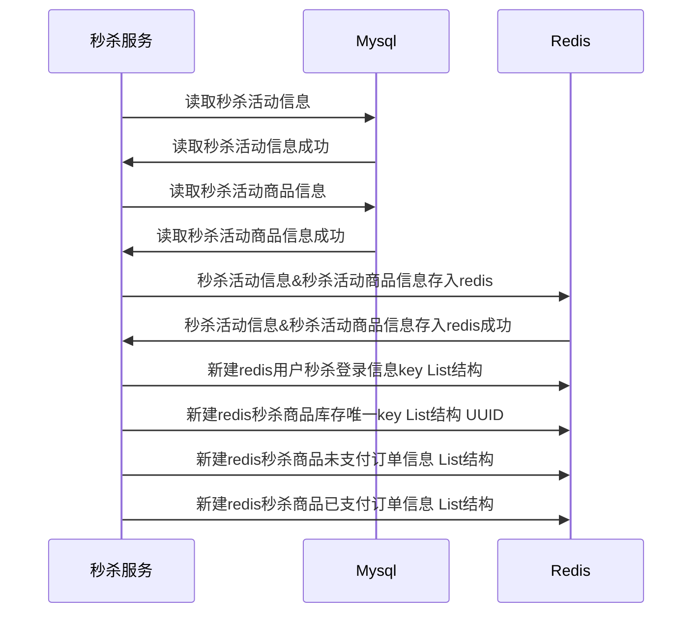
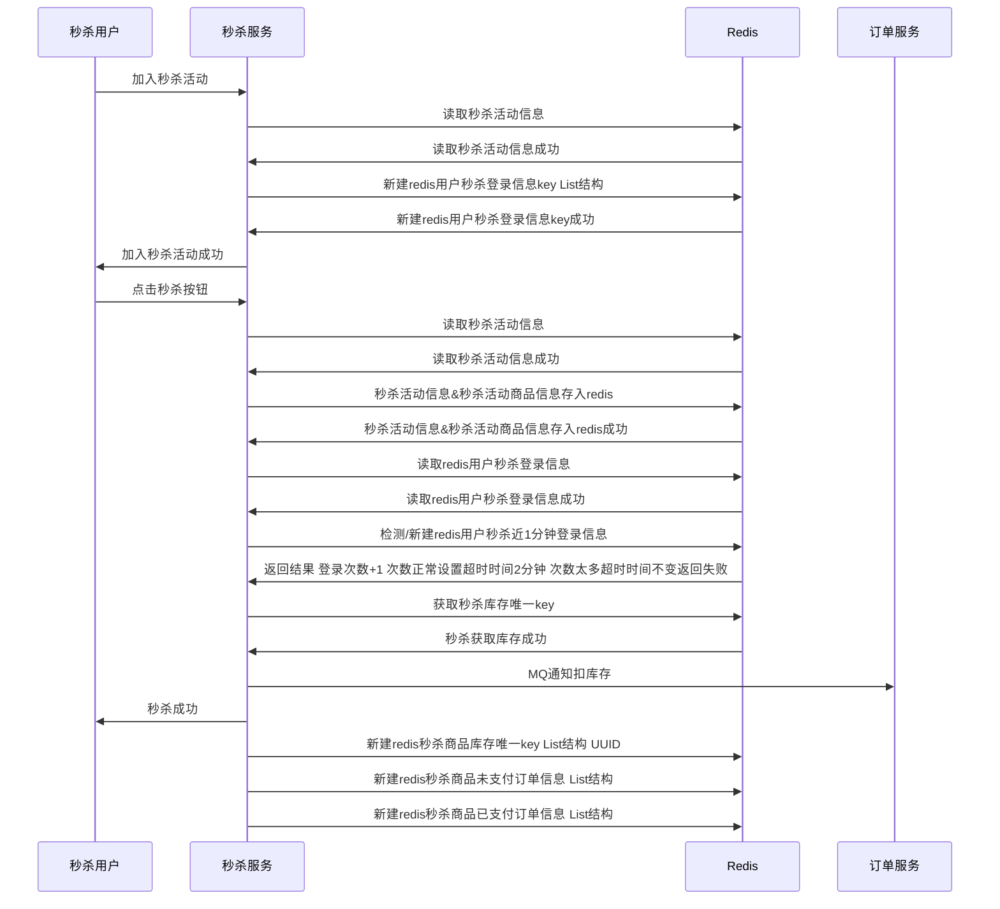

# killsystem
https://mermaid-js.github.io/mermaid/#/sequenceDiagram

docker-compose参考
```
docker-compose build 重新构建镜像
docker-compose up 运行
docker-compose logs 查看运行日志
docker-compose logs xxx 查看某服务运行日志
docker-compose stop 表示停止相关容器的运行
docker-compose rm 删除容器

```
https://docs.docker.com/compose/reference/up/ 启动服务
https://www.cnblogs.com/zhangzihong/p/7027566.html
https://docs.docker.com/compose/environment-variables/ 设置环境变量

部署指令
参考command
/command 全局docker-compose部署 docker-compose-env.yml是环境部署 docker-compose-app-build.yml是app部署

/cloudkill/command 单一服务部署方法 和Dockerfile绑定
/payment/command 单一服务部署方法 和Dockerfile绑定

# 业务用例

## 后台管理员



## 秒杀用户





# 订单与支付模块


## MQ订单建立



## 订单付款成功



## 订单超时




## 订单退款 活动生效中 未发货




## 订单退款 活动未生效 未发货


# 秒杀模块


## 预热




## 秒杀




## 异步扣库存

